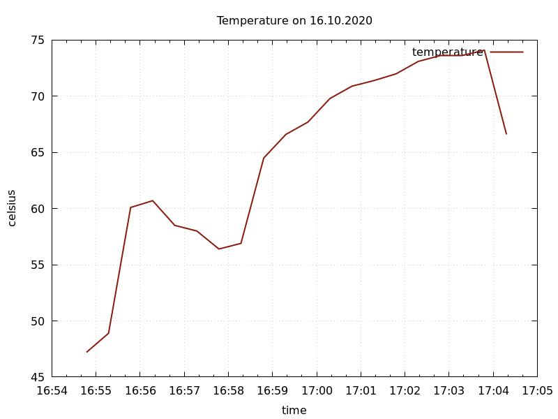

# Performance Report

In this report I will be discussing the correlation between the rising temperature of my Raspberry Pi 3+ and its process of compiling and building the linux kernel during the 'build_kernel' script I have created.

Here's the graph:

This graph was created by using gnuplot and the output data that was stored in 'kernel_performance_data' file from the 'get_temp' script that I have created and ran during the compiling process. 

As you can see, the device temperature increased and decreased throughout the building/compiling process. At 16:55 I started the script and the CPU temp went to 61 degrees celsius and backdown to 56 at 16:58. Within this timeframe, the device was installing the dependencies, cloning both kernel and assignment repositories, and configurating the kernel.

From 16:58 and 56 degrees it peaked to 74 degrees celsius by 17:03, this is when the script was in the building/compiling kernel phase. 

The reason why temperature increases throughout the process is because of the CPU load. The more demanding the task for the CPU, the more electricity that passes through it, thus generating more heat. After all the tasks are executed and the kernel compiling is complete, the device settles down to its idle temperatures at ~40 degrees celsius, as its no longer performing demanding tasks.

Milos Mladenovic - s3656006
